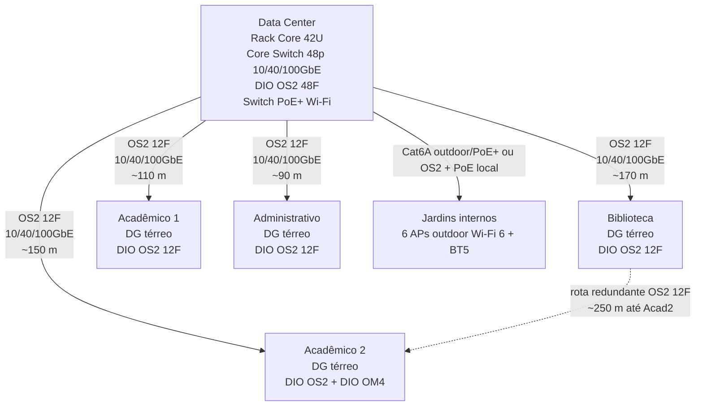
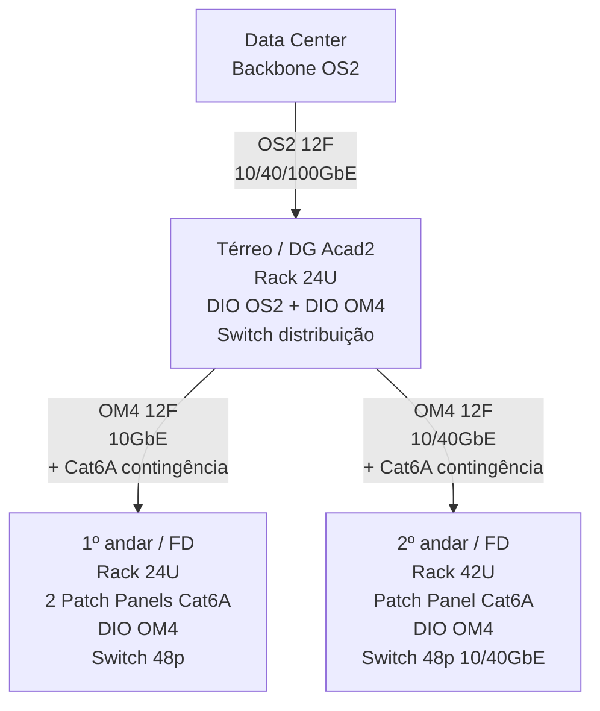
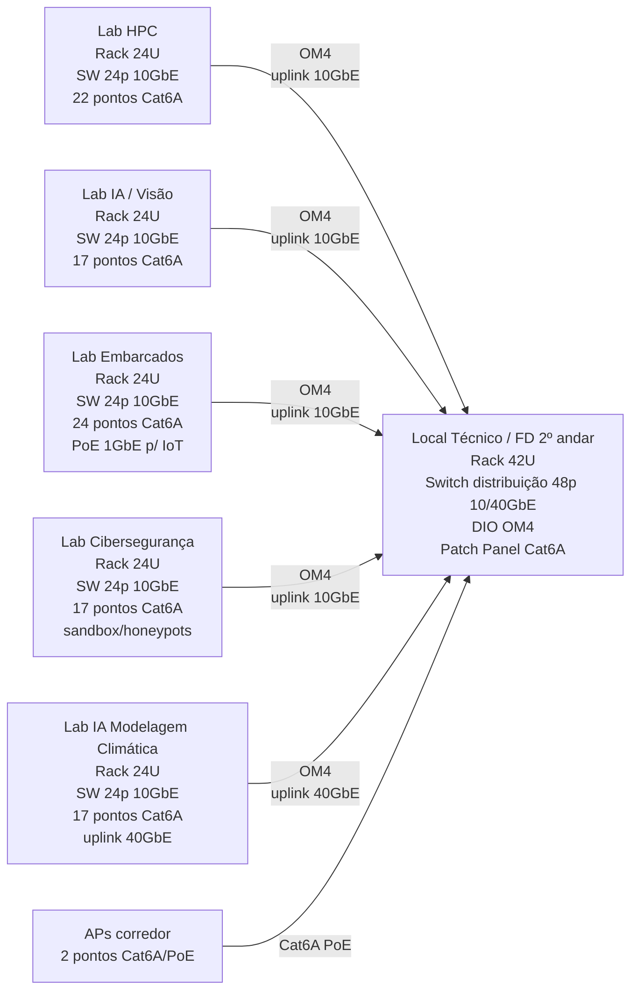

# Projeto de Cabeamento Estruturado

**PCS3724 – Redes de Computadores 2 — Escola de Engenharia de Computação (EEC)**
Entrega: Projeto de Cabeamento Estruturado do **Prédio Acadêmico 2** e da **rede backbone de interconexão** de todos os prédios do campus.

> Escopo da entrega de 30/06/2026: cabeamento estruturado detalhado do Prédio Acadêmico 2, backbone de interconexão entre todos os prédios do campus e rede wireless dos jardins/espaços públicos.

**Normas de referência:** ABNT NBR 14565:2019, ISO/IEC 11801, ANSI/TIA-568.2-D (par trançado), ANSI/TIA-568.3-D (fibra óptica), ANSI/TIA-569-E (espaços e encaminhamentos), ANSI/TIA-758-B (planta externa) e ANSI/TIA-606-C (identificação e documentação).

**Terminologia:** SE = Sala de Equipamentos (Local Técnico indicado nas plantas); DG = Distribuidor Geral do prédio; DIO = Distribuidor Interno Óptico; LIU = Light Interface Unit; FD = Floor Distributor (distribuidor de andar); AP = Access Point.

---

## 0. Premissas e decisões gerais de projeto


| Decisão                                   | Valor adotado                                       | Justificativa                                                                                                                                                 |
| ----------------------------------------- | --------------------------------------------------- | ------------------------------------------------------------------------------------------------------------------------------------------------------------- |
| **Escalabilidade**                        | **20%** (faixa permitida 10%–30%)                   | Ambiente de pesquisa/ensino com expansão prevista, mas plantas de ocupação já bem definidas. 20% equilibra custo e crescimento.                               |
| **Cabo horizontal (padrão)**              | **Par trançado Cat6A U/FTP**                        | Suporta 10GBASE-T até 100 m; padroniza toda a planta e atende os labs de 10 GbE do 2º andar sem troca futura de cabo.                                         |
| **Encaminhamento horizontal**             | **Teto (forro) + descida em parede**                | Eletrocalha/leito no forro do corredor e descidas em canaleta pela parede até a tomada RJ45 (keystone). Evita interferência com o piso e facilita manutenção. |
| **Backbone vertical (predial)**           | **Fibra óptica multimodo OM4**                      | Lances curtos (< 30 m); OM4 entrega 10/40 GbE com baixo custo. Pares redundantes por andar.                                                                   |
| **Backbone de campus**                    | **Fibra óptica monomodo OS2**                       | Distâncias externas de até ~170 m e necessidade de suportar 10/40/100 GbE e crescimento futuro; SMF é a opção mais durável.                                   |
| **Distância máxima do enlace permanente** | 90 m (canal 100 m com cordões)                      | Limite Cat6A. Verificado: maior lance interno do Acad2 fica abaixo de 90 m.                                                                                   |
| **Padrão de racks**                       | 19", padrão                                         | Alojam patch panels, DIOs e switches.                                                                                                                         |
| **Conectores por ponto**                  | 2 (tomada RJ45 no work area + porta no patch panel) | Um enlace = 1 keystone + 1 posição de patch panel.                                                                                                            |


**Modelo de arquitetura (hierarquia TIA/ISO):**

```
Estação (Área de Trabalho)
   └─ Cabeamento HORIZONTAL (Cat6A) ──► FD / Sala de Equipamentos do andar
        └─ Cabeamento VERTICAL (OM4) ──► DG (térreo do prédio)
             └─ Cabeamento de CAMPUS (OS2) ──► Sala de Equipamentos do Data Center
```

---

## 1. Cabeamento Horizontal — Prédio Acadêmico 2

O Acadêmico 2 possui **3 andares (70 m × 40 m cada)**. Em cada andar há um **Local Técnico** (Sala de Equipamentos) no canto superior direito, que funciona como Distribuidor de Andar (FD).

### 1.a Definições comuns a todos os andares

- **Escalabilidade:** 20% de pontos excedentes (aplicado sobre a demanda base) e reserva equivalente no patch panel.
- **Tipo de cabo:** Cat6A U/FTP, 4 pares, CMR (interno).
- **Rota:** leito/eletrocalha metálica no forro do corredor central, com descidas verticais em canaleta de PVC até as caixas de tomada (2 keystones RJ45 por caixa quando aplicável).
- **Tomadas:** keystone Cat6A + espelho/caixa 4×2.
- **Patch panel:** 24 portas Cat6A, descarregado por organizadores horizontais.
- **Infraestrutura de passagem:** eletrocalha metálica perfurada 100×50 mm no corredor, canaleta PVC 50×20 mm nas descidas e perfilado suspenso 38×38 mm sobre bancadas dos laboratórios quando houver equipamentos no centro da sala.
- **Identificação:** cada ponto deve seguir padrão `A2-[andar]-[sala/lab]-[sequencial]`, por exemplo `A2-2-CIBER-01`, com a mesma etiqueta na tomada, no patch panel e na documentação.

### 1.b Térreo — Pós-graduação (5 salas de aula, 1 micro/sala)


| Item                           | Qtd base      |
| ------------------------------ | ------------- |
| Micros (5 salas × 1)           | 5             |
| Impressora de rede             | 1             |
| Access Points Wi-Fi (corredor) | 2             |
| **Base**                       | **8**         |
| **+20% escalabilidade**        | **10 pontos** |


- **Patch panels:** 1 × 24 portas (10 usados, 14 de reserva).
- **Rack:** 1 rack de parede 12U no Local Técnico.

### 1.c 1º andar — Pesquisa e Extensão (5 salas de prof. + 5 salas de aula)


| Item                                      | Qtd base      |
| ----------------------------------------- | ------------- |
| Micros de professores (5 salas × 3 prof.) | 15            |
| Servidores (1 por sala de professor)      | 5             |
| Micros das salas de aula (5 × 1)          | 5             |
| Impressoras de rede                       | 2             |
| Access Points Wi-Fi                       | 3             |
| **Base**                                  | **30**        |
| **+20% escalabilidade**                   | **36 pontos** |


- **Patch panels:** 2 × 24 portas (36 usados, 12 de reserva).
- **Rack:** 1 rack fechado 24U no Local Técnico.

### 1.d 2º andar — Laboratórios de Pesquisa (5 labs) — *dimensionamento*

Este andar abriga os 5 laboratórios de pesquisa da EEC. Cada laboratório possui **rack próprio com switch 10 GbE de 24 portas** (conforme especificado nas descrições dos laboratórios), funcionando como **ponto de consolidação (CP)**. Os pontos internos de cada lab são cabeados em Cat6A até o rack do próprio lab (lances curtos), e cada rack de lab sobe por **fibra OM4** até o Local Técnico do andar (FD), que agrega o tráfego e conecta ao backbone vertical.

Dimensionamento de pontos por laboratório (com base na infraestrutura física descrita na entrega anterior):


| Laboratório                                   | Workstations | Servidores                | NAS/Storage | Outros (gateways/IoT/sandbox/mgmt) | AP  | Base           |
| --------------------------------------------- | ------------ | ------------------------- | ----------- | ---------------------------------- | --- | -------------- |
| Computação de Alto Desempenho (HPC)           | 10           | 8 (cluster)               | 1           | 2                                  | 1   | 22             |
| IA, Visão Computacional e Sist. Inteligentes  | 10           | 4                         | 1           | 1                                  | 1   | 17             |
| Sistemas Embarcados / Hardware Reconfigurável | 10           | 2                         | 1           | 10 (bancadas / gateways IoT)       | 1   | 24             |
| Cibersegurança e Privacidade                  | 8            | 4 (3 análise + 1 sandbox) | 1           | 3 (honeypots / coletores)          | 1   | 17             |
| IA para Modelagem Climática                   | 10           | 4                         | 1           | 1                                  | 1   | 17             |
| Área comum / corredor (APs)                   | —            | —                         | —           | —                                  | 2   | 2              |
| **Base total do andar**                       |              |                           |             |                                    |     | **99**         |
| **+20% escalabilidade**                       |              |                           |             |                                    |     | **119 pontos** |


- **Patch panels (Cat6A):** 1 por lab (24 portas) + 1 no FD para gerência/área comum = **6 × 24 portas**.
- **Racks:** 5 racks (um por lab, 24U) + 1 rack FD (42U) no Local Técnico = **6 racks**.
- **Uplinks dos labs → FD:** 1 fibra OM4 (par + 1 par reserva) por lab, terminada em DIO no rack do lab e no FD.

### 1.e Resumo do cabeamento horizontal do Acadêmico 2


| Andar     | Pontos (c/ 20%) | Patch panels 24p | Racks             |
| --------- | --------------- | ---------------- | ----------------- |
| Térreo    | 10              | 1                | 1 (12U parede)    |
| 1º andar  | 36              | 2                | 1 (24U)           |
| 2º andar  | 119             | 6                | 6 (5×24U + 1×42U) |
| **Total** | **165**         | **9**            | **8**             |


**Estimativa de materiais horizontais (Acad2):**


| Material                                       | Cálculo                                           | Quantidade               |
| ---------------------------------------------- | ------------------------------------------------- | ------------------------ |
| Tomadas keystone RJ45 Cat6A (área de trabalho) | 1 × 165                                           | 165                      |
| Conectores/portas no patch panel               | 1 × 165                                           | 165                      |
| **Conectores RJ45 totais**                     | 2 × 165                                           | **330**                  |
| Cabo Cat6A U/FTP (estimativa conservadora)     | 165 pontos × ~40 m médios × 1,1 (folga) ≈ 7.260 m | **≈ 24 caixas de 305 m** |
| Eletrocalha metálica 100×50 mm                 | espinha central + ramais dos 3 andares            | ≈ 300 m                  |
| Canaleta PVC 50×20 mm                          | descidas até tomadas e bancadas                   | ≈ 120 m                  |
| Perfilado suspenso 38×38 mm                    | bancadas dos laboratórios do 2º andar             | ≈ 75 m                   |
| Patch cords Cat6A (2 por ponto: WA + rack)     | 2 × 165                                           | 330                      |
| Organizadores horizontais 1U                   | 1 por patch panel/switch crítico                  | 14                       |


> *Comprimento médio de 40 m* estimado pela média entre lances curtos dos racks locais dos laboratórios e lances mais longos partindo do Local Técnico. O valor final depende do detalhamento executivo das rotas.

### 1.f Verificação do pior caso de enlace

O limite normativo para o cabeamento horizontal em par trançado é de **90 m de enlace permanente** e **100 m de canal completo** (incluindo patch cords). O pior caso do Acadêmico 2 ocorre em uma tomada no extremo sudoeste do andar, partindo do Local Técnico no canto nordeste:


| Trecho estimado                                  | Comprimento |
| ------------------------------------------------ | ----------- |
| Percurso leste-oeste pelo corredor/eletrocalha   | ~55 m       |
| Percurso norte-sul até a sala/bancada            | ~25 m       |
| Subidas, descidas, curvas e folga de rack/tomada | ~8 m        |
| **Enlace permanente estimado**                   | **~88 m**   |
| Patch cords no rack e na área de trabalho        | até 10 m    |
| **Canal completo estimado**                      | **~98 m**   |


Assim, mesmo no pior caso, o projeto permanece dentro do limite de **90 m / 100 m** da TIA-568 para Cat6A.

---

## 2. Cabeamento Vertical (backbone do Prédio Acadêmico 2)

Interliga a Sala de Equipamentos de cada andar ao **Distribuidor Geral (DG)** do prédio, localizado no Local Técnico do **térreo** (co-localizado com a SE do térreo).

- **Tipo de cabo:** fibra óptica **OM4 multimodo**, cabo interno tight-buffer, **12 fibras (6 pares)** por lance — capacidade + redundância (agregação/LACP e caminho reserva).
- **Rota:** shaft/prumada vertical de telecom junto ao Local Técnico (canto superior direito, alinhado nos 3 andares), em eletrocalha vertical dedicada.
- **Proteção da prumada:** eletroduto metálico galvanizado de 2", aterramento, organização por bandeja e selagem corta-fogo (*firestop*) nas travessias de laje.
- **Lances:**
  - 1º andar → DG (térreo): ~8 m
  - 2º andar → DG (térreo): ~13 m
- **Terminação:** DIO (24 fibras) em cada SE de andar e no DG.
- **Contingência:** 4 cabos Cat6A adicionais por andar entre DG e FD para gerência fora de banda, console serial/Ethernet de emergência ou serviço temporário de manutenção.


| Material (vertical Acad2)            | Quantidade                                      |
| ------------------------------------ | ----------------------------------------------- |
| Cabo óptico OM4 12F (interno)        | 2 lances (~15 m + ~20 m c/ folga) ≈ 35 m        |
| DIO / bandeja óptica (24F)           | 3 (1 por andar + reforço no DG)                 |
| Conectores LC/UPC (pigtails)         | 2 lances × 12F × 2 pontas = 48                  |
| Cordões ópticos LC-LC OM4            | 12 (uplinks switches ↔ DIO)                     |
| Rack DG (térreo)                     | usa o rack do térreo (ampliado p/ 24U)          |
| Cabo Cat6A de contingência vertical  | 8 lances (~200 m incluídos na reserva de cobre) |
| Eletroduto galvanizado 2" + firestop | 1 shaft entre os 3 pavimentos                   |


> **Conexão do prédio com o campus:** o DG do térreo concentra também a terminação do backbone de campus (ver Seção 3), a partir do qual o Acadêmico 2 chega ao Data Center.

---

## 3. Cabeamento do Campus (prédios → Data Center)

Interliga a Sala de Equipamentos (DG térreo) de cada prédio à **Sala de Equipamentos do Data Center**, que concentra o núcleo da rede.

- **Tipo de cabo:** fibra óptica **OS2 monomodo**, cabo externo (armado/geleado, uso subterrâneo), **12 fibras (6 pares)** por prédio — suporta 10/40/100 GbE e crescimento; pares de reserva para redundância.
- **Rota:** dutos subterrâneos passando pelos **jardins internos**, com caixas de passagem entre os prédios. A topologia lógica é em estrela a partir do Data Center; a infraestrutura física de dutos deve ser preparada como anel para permitir redundância futura.
- **Redundância crítica:** o Prédio Acadêmico 2 recebe uma rota principal direta ao Data Center e uma rota redundante alternativa via região da Biblioteca, pois concentra os cinco laboratórios de pesquisa e a maior parte do tráfego científico.
- **Distâncias estimadas** (rota real pelos dutos + folga de subida/terminação; medidas base extraídas do diagrama "Dimensões do Campus"):


| Enlace (prédio → Data Center)                              | Distância estimada de cabo |
| ---------------------------------------------------------- | -------------------------- |
| Acadêmico 2 → Data Center                                  | ≈ 150 m                    |
| Biblioteca → Data Center                                   | ≈ 170 m                    |
| Acadêmico 1 → Data Center                                  | ≈ 110 m                    |
| Administrativo → Data Center                               | ≈ 90 m                     |
| Acadêmico 2 → Data Center (rota redundante via Biblioteca) | ≈ 250 m                    |
| **Total de cabo de campus**                                | **≈ 770 m**                |


> As distâncias combinam o deslocamento horizontal entre prédios (medidas de 40/70/20 m do diagrama), a travessia dos jardins e ~15–20 m de folga por prumada/terminação. OS2 opera folgadamente nessas distâncias.


| Material (campus)                                                 | Quantidade                                        |
| ----------------------------------------------------------------- | ------------------------------------------------- |
| Cabo óptico OS2 12F externo                                       | ≈ 770 m (4 lances principais + redundância Acad2) |
| DIO / distribuidor óptico (24F) nos prédios                       | 4 (1 por prédio: Acad2, Biblioteca, Acad1, Admin) |
| DIO de concentração no Data Center                                | 1 de alta densidade (48F) agregando os 4 enlaces  |
| Conectores LC/UPC (pigtails)                                      | 5 enlaces × 12F × 2 pontas = 120                  |
| Cordões ópticos LC-LC OS2 (uplinks p/ switches core/distribuição) | 20                                                |
| Rack de backbone no Data Center                                   | 1 (42U, ambiente de vão livre virtualizado)       |
| Duto PEAD 100 mm com subdutos                                     | ≈ 800 m (anel pelos jardins e derivações)         |
| Caixas de passagem subterrâneas                                   | 8 (a cada ~60 m e nas entradas dos prédios)       |


---

## 4. Rede Wireless (jardins e espaços públicos)

Pontos de acesso Wi-Fi para os alunos nos **jardins internos** e espaços públicos, conectados diretamente à **Sala de Equipamentos do Data Center**.

- **Localização dos APs:** cobertura dos jardins internos entre os prédios; estimados **6 APs outdoor** (IP67, dual-band Wi-Fi 6 + BT5), distribuídos para cobrir a área central e os corredores externos entre as edificações.
- **Alimentação:** PoE+ a partir de um switch PoE no Data Center.
- **Tipo de cabo:**
  - APs a **≤ 90 m** do DC: **Cat6A outdoor (CMX/UV)** com PoE — cobre a maioria dos jardins, já que o Data Center é central-inferior no campus.
  - APs a **> 90 m** (extremidades): **fibra OS2** até uma caixa de passagem + **injetor/switch PoE local** para o trecho final em Cat6A.
- **Rota:** mesmos dutos subterrâneos do backbone de campus, com derivações para as bases dos APs (postes/luminárias).

Distribuição sugerida:


| AP    | Localização sugerida                 | Meio físico                  | Observação                          |
| ----- | ------------------------------------ | ---------------------------- | ----------------------------------- |
| AP-J1 | Entre Biblioteca e jardins centrais  | OS2 4F + conversor PoE local | Percurso > 90 m                     |
| AP-J2 | Centro dos jardins                   | Cat6A outdoor + PoE+         | Percurso <= 90 m                    |
| AP-J3 | Entre Acadêmico 2 e jardins centrais | OS2 4F + conversor PoE local | Percurso > 90 m                     |
| AP-J4 | Próximo ao Data Center               | Cat6A outdoor + PoE+         | Percurso curto                      |
| AP-J5 | Próximo ao Acadêmico 1               | Cat6A outdoor + PoE+         | Cobertura da área inferior esquerda |
| AP-J6 | Próximo ao Administrativo            | Cat6A outdoor + PoE+         | Cobertura da área inferior direita  |


| Material (wireless de campus)                   | Cálculo                             | Quantidade          |
| ----------------------------------------------- | ----------------------------------- | ------------------- |
| Access Points outdoor (Wi-Fi 6 + BT5, PoE)      | cobertura dos jardins               | 6                   |
| Cabo Cat6A outdoor                              | 4 APs × ~70 m médios × 1,1 ≈ 310 m  | ≈ 2 caixas de 305 m |
| Cabo óptico OS2 4F externo                      | 2 APs remotos × ~130 m médios × 1,1 | ≈ 280 m             |
| Switch PoE+ 24 portas (no DC)                   | agrega os APs de jardim             | 1                   |
| Conversores de mídia industriais com saída PoE+ | AP-J1 e AP-J3                       | 2                   |
| Caixas herméticas IP66/IP67 para poste          | APs com conversor/fonte local       | 2                   |
| Protetores de surto Ethernet/PoE                | enlaces Cat6A outdoor               | 8                   |
| Conectores RJ45 Cat6A (outdoor)                 | 2 × 4 APs cabeados em cobre         | 8                   |
| Rack                                            | usa o rack de backbone do DC        | —                   |


---

## 5. Diagramas topológicos propostos

Os diagramas abaixo podem ser usados como base para desenhar no diagrams.net/draw.io. Eles não substituem a planta arquitetônica, mas atendem ao pedido do enunciado de mostrar topologia, locais, tecnologias, velocidades e equipamentos ativos.

### 5.a Backbone do campus




### 5.b Backbone vertical do Acadêmico 2




### 5.c Cabeamento horizontal do 2º andar




---

## 6. Quadro-resumo geral de quantitativos


| Categoria         | Racks             | Patch panels 24p (cobre) | DIO ópticos               | Cabo cobre (Cat6A)  | Cabo óptico     |
| ----------------- | ----------------- | ------------------------ | ------------------------- | ------------------- | --------------- |
| Horizontal Acad2  | 8                 | 9                        | —                         | ≈ 24 caixas (305 m) | —               |
| Vertical Acad2    | (usa racks acima) | —                        | 3 (OM4)                   | —                   | ≈ 35 m OM4 12F  |
| Campus (backbone) | 1 (DC)            | —                        | 5 (OS2)                   | —                   | ≈ 770 m OS2 12F |
| Wireless jardins  | (usa rack DC)     | 1 (DC)                   | caixas/conversores locais | ≈ 2 caixas outdoor  | ≈ 280 m OS2 4F  |
| **Totais**        | **9**             | **10**                   | **8 + caixas locais**     | **≈ 26 caixas**     | **≈ 1.085 m**   |


**Conectores (visão geral):** RJ45 Cat6A ≈ 330 (horizontal) + 8 (outdoor) = **338**; conectores ópticos LC/UPC ≈ 48 (vertical) + 120 (campus) + terminações dos APs remotos = **≈ 176**.

---

## 7. Observações e pontos em aberto (para revisão do grupo)

1. **Comprimentos de cabo** são estimativas de anteprojeto (baseadas nas dimensões dos diagramas). O comprimento definitivo exige o projeto detalhado de rotas/dutos.
2. **Densidade de pontos do 2º andar** assume que cada lab mantém seu próprio switch/rack (como descrito nos laboratórios). Caso o grupo prefira **home-run** total até o Local Técnico do andar, o número de painéis/racks no FD aumenta e cai o número de racks nos labs.
3. **Redundância de campus:** foi adicionada uma rota redundante para o Acadêmico 2, pois é o prédio crítico de pesquisa. Se o grupo quiser reduzir custo, essa rota pode voltar a ser apenas previsão futura.
4. **Número de APs de jardim (6)** é estimativa de cobertura; pode ser refinado com a área exata dos jardins internos.
5. Padronizamos **Cat6A** em toda a planta; para as salas de aula/pós (tráfego leve) seria possível usar Cat6 e reduzir custo, ao preço de perder uniformidade e o suporte nativo a 10 GbE.

